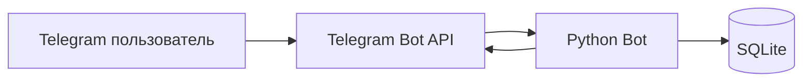

# 📅 Научный календарь — Telegram Bot

[](https://www.python.org/)
[](https://core.telegram.org/bots/api)
[](https://www.sqlite.org/)
[](LICENSE)

**Научный календарь** — это Telegram-бот для популяризации истории науки и техники. Он ежедневно присылает информацию о значимых научных открытиях и днях рождения учёных, поддерживает интерактивные викторины, формирует рейтинг пользователей и позволяет получить случайный научный факт по запросу.

Проект создан для автоматизации образовательного контента и может быть использован в учебных курсах по истории науки, а также для широкой аудитории, интересующейся научным наследием.

## ✨ Возможности

| Функция | Описание |
|---------|----------|
| 📅 **Сегодня в науке** | Показывает событие или учёного текущего дня |
| 🎲 **Случайное событие** | Выдаёт случайный научный факт из базы |
| ❓ **Случайная викторина** | Проверяет знания с помощью вопросов с вариантами ответов |
| 📊 **Мой рейтинг** | Показывает личную статистику правильных и неправильных ответов |
| 🏆 **Топ пользователей** | Выводит таблицу лидеров среди всех участников |
| 🔔 **Ежедневная рассылка** | Каждое утро в 9:00 присылает событие дня |

## 🏗️ Архитектура проекта




## 🚀 Установка и запуск

### 1. Клонировать репозиторий


---

### 2. Создать и активировать виртуальное окружение

**Windows:**

```bash
python -m venv venv
venv\Scripts\activate
```

**Mac / Linux:**

```bash
python3 -m venv venv
source venv/bin/activate
```

---

### 3. Установить зависимости

```bash
pip install -r requirements.txt
```

---

### 4. Настроить переменные окружения

Скопируй файл `.env.example` в `.env`:

```bash
cp .env.example .env
```

Открой файл `.env` и добавь свой токен:

```env
BOT_TOKEN=твой_токен_от_BotFather
```

**Как получить токен:**

1. Напиши [@BotFather](https://t.me/BotFather) в Telegram
2. Отправь команду `/newbot`
3. Придумай имя и username для бота
4. Скопируй полученный токен

---

### 5. Инициализировать базу данных

```bash
python database.py
```

База данных `scientific.db` создастся автоматически с тестовыми данными.

---

### 6. Запустить бота

```bash
python main.py
```

---

### 7. Проверить работу

1. Открой Telegram
2. Найди своего бота по username
3. Отправь команду `/start`
4. Должно появиться главное меню с кнопками

---

## 📋 Что должно появиться в консоли

После успешного запуска ты увидишь:

```
✅ База данных инициализирована
🚀 Запуск бота 'Научный календарь'...
✅ Ежедневная рассылка настроена на 9:00 утра
✅ Бот готов к работе!
```

